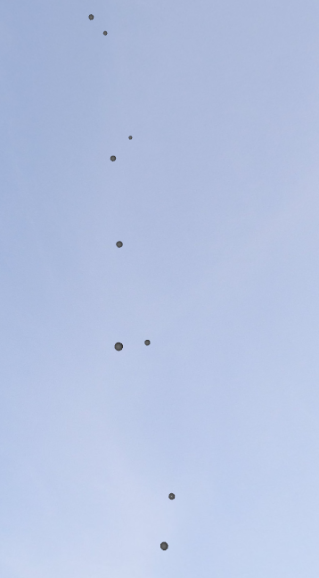
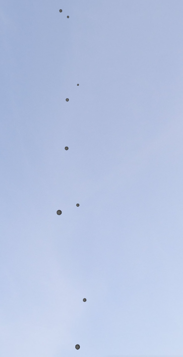
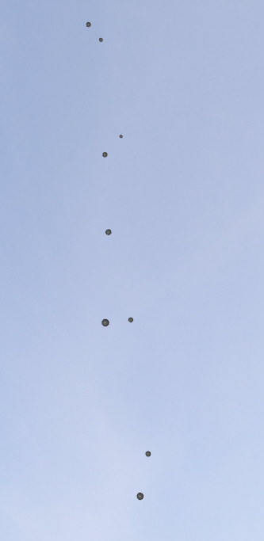

# GSoC Week 3 - Qt3D based backend for KStars

In the third week of GSoC, I worked on defining a coordinate system which works on right ascension and declination instead of x, y and z coordinates. 

## What's done this week

- Shaders for Lambert, Azimuthal, Orthographic, Equirectangular, Stereographic and Gnomic projections.

- Shaders for instanced rendering with support for the above projection modes(Will be used for stars).

## The Challenges

- Integration issues with the original SkyPainter API written to support multiple backends - Had to prototype outside of KStars.

- Llack of C++ resources for Qt3D.

- Switching SkyQPainter's 2D projector class to GLSL.

## What remains

My priorities for the next week include.

- Integrating existing and KStars backend.

- Display of grid lines and basic star catalog using SkymapComposite.

## Demo

## The Code

 - [Prototype for projections](https://github.com/Paritosh97/celestial-sphere-sim)
 - [My fork for KStars](https://invent.kde.org/paritosh/kstars)
