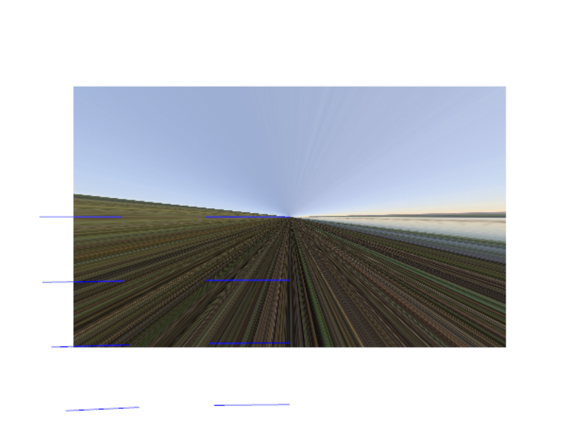
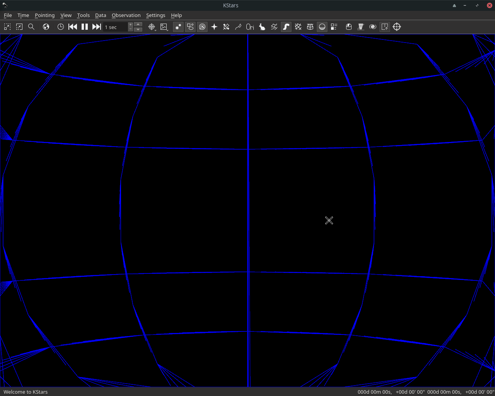

# GSoC Review 1 - Qt3D based backend for KStars

In the fourth week of GSoC, I worked on adding support for Skybox which supports the projection modes implemented last week. I also added the grid implementation in KStars based on the prototype.

## What's done this week

- Custom Skybox and Skybox shaders for Lambert, Azimuthal, Orthographic, Equirectangular, Stereographic and Gnomic projections.

- Custom Window3D class extending Qt3DWindow for mouse movements.

- Equatorial grid based on the prototype.

## The Challenges

- Integration issues with the original SkyPainter API written to support multiple backends - Had to prototype outside of KStars.

- Had to remove QCamera and first person controllers since they don't conform to projection modes we use.

- Switching SkyQPainter's 2D projector class to GLSL.

## What remains

My priorities for the next week include.

- Adding mouse input.

- Display of basic star catalog.

## Demo

## The Code

 - [Celestial Sphere Prototype](https://github.com/Paritosh97/celestial-sphere-sim)
 - [My fork for KStars](https://invent.kde.org/paritosh/kstars)
