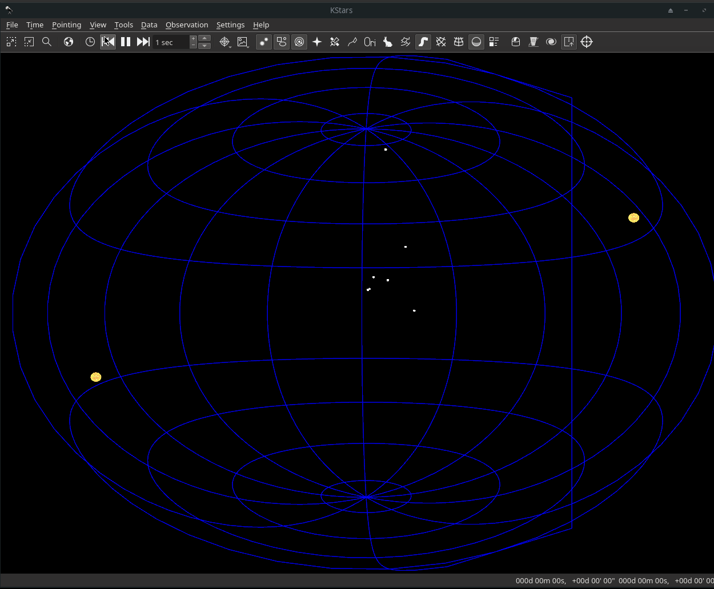

# GSoC Review 2 - Qt3D based backend for KStars

In the eighth week of GSoC, I continued on init and update calls to skymapcompsite and subsequent classes derived from skycomponent.

## What's done this week

- Init calls for various skycomponent derived classes which help setup the Qt3D scenegraph like CatalogComponent.

- Update calls for stars, planets, lines and similar sky components.

## The Challenges

- Integration issues with the original SkyPainter API written to support multiple backends. The CustomWindow class doesn't utilize SkyPainter but has similar draw calls.

## What remains

- Completing all the update calls

- Debugging and adding other sky objects.

- Fixing star sizes

## Demo

## The Code

 - [Celestial Sphere Prototype](https://github.com/Paritosh97/celestial-sphere-sim)
 - [My fork for KStars](https://invent.kde.org/paritosh/kstars)
