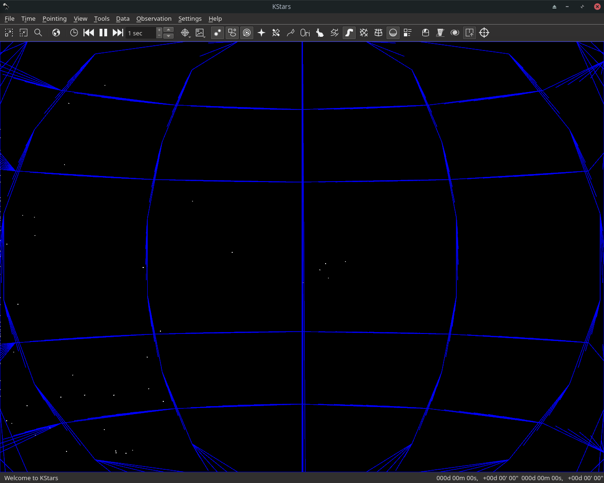

# GSoC Week 5 - Qt3D based backend for KStars

In the fifth week of GSoC, I worked on adding stars in the 3d Painter backend along with grids. Code for Qt3D is shifted to a new Skymap3D now.

## What's done this week

- Shaders for instancing all kinds of stars(labelled, unlabelled) with all projection modes.

- A new abstract camera controller.

## The Challenges

- Integration issues with the original SkyPainter API written to support multiple backends.

- Use of new custom camera controller and view matrix..

- Zooming and focus for deep star objects.

## What remains

My priorities for the next week include.

- Adding Skymap events to Skymap3D.

- Debug deep star objects and get started with other sky objects.

## Demo

## The Code

 - [Celestial Sphere Prototype](https://github.com/Paritosh97/celestial-sphere-sim)
 - [My fork for KStars](https://invent.kde.org/paritosh/kstars)
